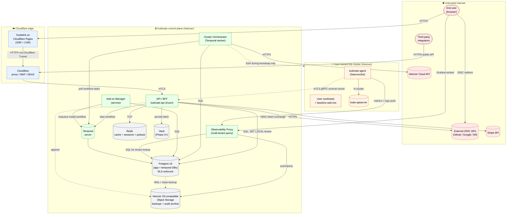

# Container Diagram (C4 Level 2)

This document is the authoritative container view of the Kubinate system.
Level 1 (system context) and Level 3 (component) diagrams live alongside
this file in the same directory and are linked at the bottom.

## Reading this diagram

- A **container** is a runtime unit — a process, a database, a managed
  service. Not a Docker container, though often one.
- **Trust boundaries** are drawn as colored regions. A message crossing
  a trust boundary must authenticate itself at the crossing.
- **Solid arrows** are synchronous calls. **Dashed arrows** are
  asynchronous (workflow, event, or agent-initiated reverse tunnel).

## Diagram

## Containers — detail

| Container                  | Tech                       | Purpose                                                          | Scaling                 |
|----------------------------|----------------------------|------------------------------------------------------------------|-------------------------|
| SvelteKit (Pages)          | Svelte + Cloudflare edge   | UI, marketing, SSR; BFF for some flows                           | Global edge             |
| API / BFF                  | Rust / Axum                | Public + frontend REST, auth, rate limiting                      | Horizontal (stateless)  |
| Cluster Orchestrator       | Rust + Temporal worker     | Cluster lifecycle workflows                                      | Worker pool             |
| Add-on Manager             | Rust                       | Helm chart catalog, install workflows                            | Co-resident with API    |
| Observability Proxy        | Rust                       | Metric/log multi-tenant query proxy + TSDB                       | Horizontal              |
| Agent                      | Rust (static binary)       | In-cluster, reverse-tunnel to control plane                      | One per user cluster    |
| Temporal                   | Temporal server            | Workflow orchestration                                           | HA in Phase 3+          |
| Postgres                   | Postgres 16                | OLTP + Temporal persistence                                      | CNPG HA in Phase 3+     |
| Redis                      | Redis 7                    | Cache, rate limit, sessions, pubsub                              | Single writer           |
| Vault                      | HashiCorp Vault            | Secrets, dynamic creds (Phase 3+)                                | HA                      |
| Object Storage             | Hetzner S3-compatible      | Backups, audit archive                                           | Managed                 |

## Trust boundaries — crossings

| Crossing                                     | Authentication                                |
|----------------------------------------------|-----------------------------------------------|
| Browser → Cloudflare                         | TLS 1.3                                       |
| Cloudflare → API                             | Cloudflare Tunnel + mTLS                      |
| API → internal services                      | mTLS, service account tokens                  |
| Control plane → user cluster (bootstrap SSH) | Ephemeral SSH key, revoked after bootstrap    |
| User cluster → control plane (steady state)  | Agent-initiated mTLS reverse tunnel           |
| API → Hetzner                                | User's encrypted Hetzner API token            |
| API → OIDC IdP                               | OIDC client ID + PKCE                         |
| API → Stripe                                 | Restricted Stripe API key                     |

The **reverse-tunnel** property is load-bearing: a user's cluster does
not require inbound firewall rules from the internet. The control plane
never holds direct kubectl credentials to customer clusters. Commands
flow only over the authenticated, agent-initiated tunnel.

## Related diagrams

- [`context.md`](./context.md) — C4 Level 1 (system context)
  *(stub for Phase 0)*
- [`components-api.md`](./components-api.md) — C4 Level 3 of the API
  container *(filled in Phase 1)*
- [`components-orchestrator.md`](./components-orchestrator.md) —
  C4 Level 3 of the Cluster Orchestrator *(filled in Phase 1)*
