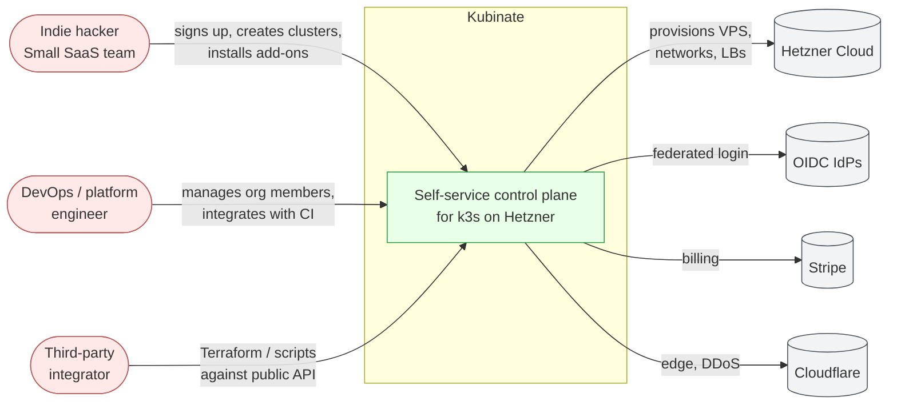

# System Context (C4 Level 1)

This is the outermost view: who and what Kubinate interacts with as a
system. Everything inside the "Kubinate" box is expanded in
[`containers.md`](./containers.md).

